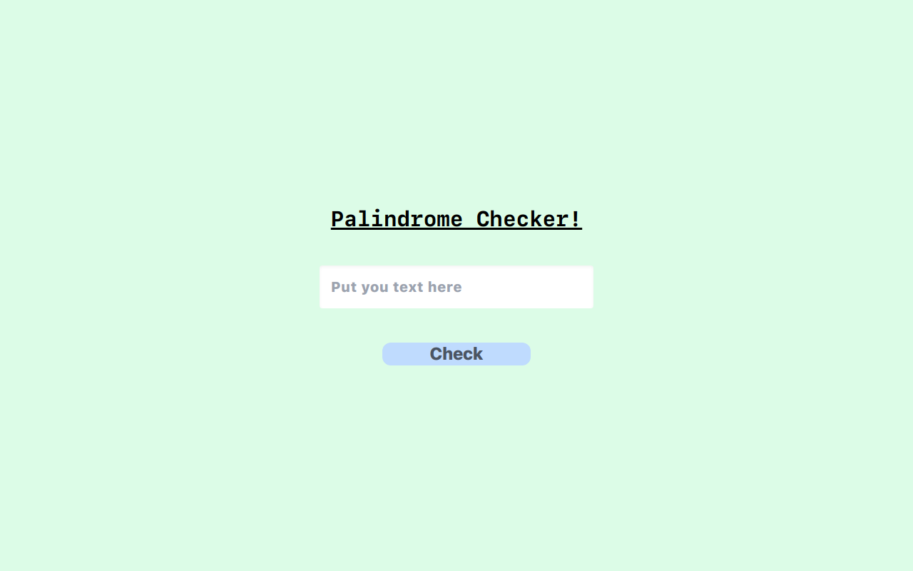

# Palindrome Text Checker  

## *What is Palindrome:*  
    : this is a text string which doesn't change even after  
      reversing it.  
      e.g: yoy = yoy  

### How does it Work -  
So this webapp takes input and check whether provided string is palindrome or not. If you give two or three words, it taked all words merge them together and then checks it for palindrome;

    It also checks numbers and special characters

[Live Link to App](https://palindrome-checker-app-js.vercel.app)  

[Source Code](https://github.com/manish-neemnarayan/palindrome-checker-app-js)

  

    

## ***Tools Used***
    1. html
    2. tailwind css
    3. JS
    4. git 
    5. Live hosting
